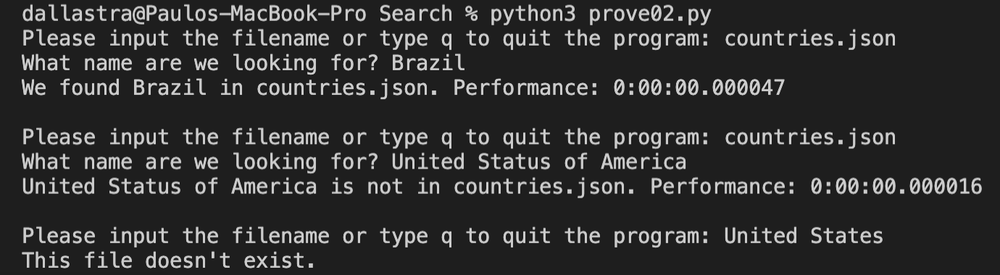

# OVERVIEW

This is an idea of Search using files. The program will ask for a
JSON file with an Object Array and then loop through a country you
want to search for. It will also give you an idea of how long it 
took to find it.

## Development Environment

* Visual Studio Code
* Python 3

## Execution

To execute the program, use the command: `python3 prove02.py` on your terminal. Then you will be requesting what you want from the "countries.json" file. After that, you only need to type the country you want to search for and it will give you an answer if the country was founded and how it took to do so.

